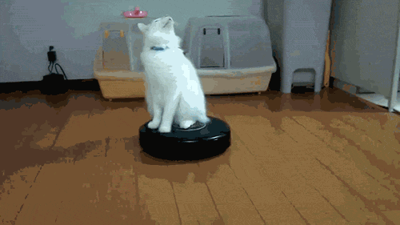

```{r echo = FALSE, message=FALSE}
require(knitr)
hook_source_def = knit_hooks$get('source')
knit_hooks$set(source = function(x, options){
  if (!is.null(options$verbatim) && options$verbatim){
    opts = gsub(",\\s*verbatim\\s*=\\s*TRUE\\s*", "", options$params.src)
    bef = sprintf('\n\n    ```{r %s}\n', opts, "\n")
    stringr::str_c(bef, paste(knitr:::indent_block(x, "    "), collapse = '\n'), "\n    ```\n")
  } else {
     hook_source_def(x, options)
  }
})
```

## But de la Formation

 - Rappels de Biostatistique
\[\bar x = \frac{1}{n}\sum_{i=1}^n x_i, s^2 = \frac{1}{n-1}\sum_{i=1}^n \left( x_i - \bar x \right)^2\]

 - Utilisation du logiciel R
```{r}
x <- rnorm(100)
mean(x)
var(x)
```


## Biostatistique

> Une définition
> Une définition
> Une définition
> Une définition
> Une définition


 - Estimation
 
```{r estimation, echo=FALSE, fig.align='center'}
X <- data.frame(a=c(rnorm(50,1),rnorm(50,3)), b=factor(rep(1:2,e=50)))
boxplot(X$a, border = "steelblue", lwd=2, horizontal=TRUE, xlab="Mesures")
```

## Biostatistique

> Une définition
> Une définition
> Une définition
> Une définition
> Une définition

 - Tests d'hypothèses

```{r test, echo=FALSE, fig.align='center'}
boxplot(a ~ b, data = X, border = "steelblue", lwd=2, horizontal=TRUE, las=1, xlab="Mesures")
```

## Biostatistique

> Une définition
> Une définition
> Une définition
> Une définition
> Une définition

 - Modèles linéaires
 
```{r modele_lineaire, echo=FALSE, fig.align='center'}
x <- rnorm(100)
y <- -2*x + 0.8*rnorm(100)
plot(x, y, col="steelblue", pch=16)
abline(lm(y~x), col="grey", lwd=3)
grid()
```

## Comprehensive R Archive Network -- CRAN

<center><a href="http://www.cran.r-project.org">   
</a></center>

## R Studio

<center><a href="http://www.rstudio.com">
  
</a></center>


## R Markdown

``` ### Titre de paragraphe ```
```Générer un échantillon aléatoire de taille 100, ```
```puis calculer sa moyenne : ```
```{r, eval=FALSE, verbatim = TRUE}
x <- rnorm(100)
mean(x)
```

## R Markdown

### Titre de paragraphe

Générer un échantillon aléatoire de taille 100,
puis calculer sa moyenne :

```{r}
x <- rnorm(100)
mean(x)
```

## Supports de cours -- GitHub

<center><a href="https://github.com/PF-BB/BoostR">
  
</a></center>

## Ressources pédagogiques -- Biostatistique


## Ressources pédagogiques -- R


# Let's go!

<center>

</center>


