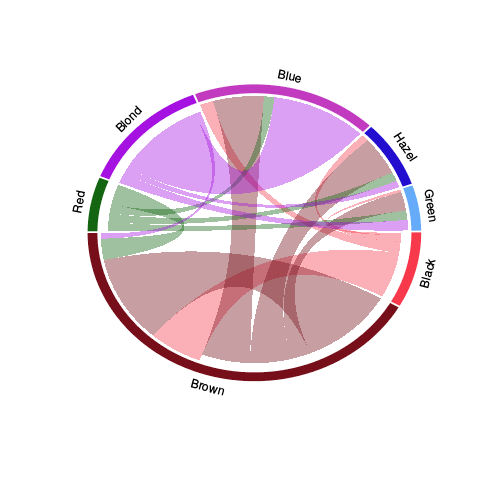

## Test d'hypothèse

> Evaluation d'un certain type de modèles statistiques à partir d'un jeu de données.


# Visualisation

<center>

</center>

## Avant tout test : Visualiser !

```{r beeswarm, echo=FALSE, message=FALSE}
require(beeswarm)
set.seed(123)
X   <- data.frame(x=rnorm(100), y=rnorm(100,2))
X.o <- list(x=c(X$x,rnorm(2,10)), y=X$y)
X.b <- list(x=X$x, y=c(X$y, rnorm(50,7)))
boxplot(X, border = "orange", col=NA, width= c(0.5,0.5) , lwd=3)
grid()
beeswarm(X, pch=16, col="steelblue", add=TRUE)
```

Au cours de la visualisation : inspecter les données à la recherche de particularités qui auront une influence forte sur l'analyse statistique.

## Outliers

```{r outliers, echo=FALSE, message=FALSE}
boxplot(X.o, border = "orange", col=NA, width= c(0.5,0.5) , lwd=3, main="Outliers")
grid()
beeswarm(X.o, pch=16, col="steelblue", add=TRUE)
```

## Nombre d'échantillons

```{r nb_sample, echo=FALSE, message=FALSE}
boxplot(X[1:4,], border = "orange", col=NA, width= c(0.5,0.5) , lwd=3, main="Trop peu d'échantillons")
grid()
beeswarm(X[1:4,], pch=16, col="steelblue", add=TRUE)
```

## Forme des distributions

```{r distrib, echo=FALSE, message=FALSE}
boxplot(X.b, border = "orange", col=NA, width= c(0.5,0.5) , lwd=3, main="Distribution bimodale")
grid()
beeswarm(X.b, pch=16, col="steelblue", add=TRUE)
```

## Nature des variables considérées

# Tests classiques

## Approche de Neyman & Pearson

Hypothèse nulle | Hypothèse alternative
--- | ----
La moyenne vaut 0 | La moyenne est différente de 0
La moyenne est suppérieure à 0 | La moyenne est inférieure à 0
La corrélation vaut 0 | La corrélation est différente de 0
Les $k$ moyennes sont égales | Au moins deux des moyennes sont différentes

## Approche de Neyman & Pearson -- Erreurs de types I et II

|                              | $\mathcal H_0$ est vraie | $\mathcal H_0$ est fausse |
|------------------------------|--------------------------|---------------------------|
| $\mathcal H_0$ est acceptée  |                          |    Erreur de type I       |
| $\mathcal H_0$ est rejetée   |     Erreur de type II    |                           |


> - $\alpha$ : risque de commettre une erreur de type I,
> - $\beta$  : risque de commetre une erreur de type II,
> - $1-\beta$  : puissance du test.


## Approche de Fisher


